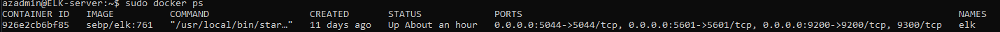

# Automated-ELK-Stack-Deployment
The files in this repository were used to configure the network depicted below

These files have been tested and used to generate a live ELK deployment on Azure. They can be used to either recreate the entire deployment pictured above. Alternatively, select portions of the playbook files may be used to install only certain pieces of it, such as Filebeat.

  - [my-playbook.yml](files/my-playbook.yml)
  - [ansible.cfg](files/ansible.cfg)
  - [hosts](files/hosts)
  - [filebeat-config.yml](files/filebeat-config.yml)
  - [filebeat-playbook.yml](files/filebeat-playbook.yml)
  - [metricbeat-config.yml](files/metricbeat-config.yml)
  - [metricbeat-playbook.yml](files/metricbeat-playbook.yml)
  - [elk-playbook.yml](files/elk-playbook.yml)
  

This document contains the following details:
- Description of the Topology
- Access Policies
- ELK Configuration
  - Beats in Use
  - Machines Being Monitored
- How to Use the Ansible Build

### Description of the Topology

The main purpose of this network is to expose a load-balanced and monitored instance of DVWA, the D*mn Vulnerable Web Application.

Load balancing ensures that the application will be highly available, in addition to restricting malicious traffic to the network.
- Loadbalancers ensure web servers are not overloaded by distributing traffic efficiently between other web servers in the network.  This is extremely important to protect against DDoS attacks. Having a jump box protects the other VMs in the network from being exposed.  It acts as another layer of security by being a "jumping" point into the network.

Integrating an ELK server allows users to easily monitor the vulnerable VMs for changes to the network and system logs.
- Filebeat monitors the log files or locations you specify, collects log events, and forwards them either to Elasticsearch or Logstash for indexing
- Metricbeat periodically collects metrics from the operating system and from services running on the server.  It takes the metrics and statistics that it collects and ships them to the output that you specify, such as Elasticsearch or Logstash

The configuration details of each machine may be found below.

| Name     | Function | IP Address | Operating System |
|----------|----------|------------|------------------|
| Jump Box | Gateway  | 10.0.0.4   | Linux            |
| Web-1    | DVWA     | 10.0.0.5   | Linux            |
| Web-2    | DVWA     | 10.0.0.6   | Linux            |
| Web-3    | DVWA     | 10.0.0.7   | Linux            |
| ELK      | monitor  | 10.1.0.4   | Linux            |

### Access Policies

The machines on the internal network are not exposed to the public Internet. 

Only the JumpBox machine can accept connections from the Internet. Access to this machine is only allowed from a personal IP address

Machines within the network can only be accessed by SSH from the JumpBox.
- The ELK VM can only be accessed from the ansible container in the JumpBox (IP 20.22.241.124).

A summary of the access policies in place can be found in the table below.

| Name     | Publicly Accessible | Allowed IP Addresses |
|----------|---------------------|----------------------|
| Jump Box | Yes                 | WorkstationIP        |
| Web-1    | No                  | 10.0.0.4             |
| Web-2    | No                  | 10.0.0.4             |
| Web-3    | No                  | 10.0.0.4             | 
| ELK      | No                  | 10.0.0.4             |

### Elk Configuration

Ansible was used to automate configuration of the ELK machine. No configuration was performed manually, which is advantageous because it speeds up the process to install and configure the necessary applications, which makes it scalable for larger networks.  

The playbook implements the following tasks:
- install docker.io
- install Python3-pip
- install Docker module
- increase virtual memory
- use more memory
- download and launch a Docker ELK container
- enable Docker service on boot

The following screenshot displays the result of running `docker ps` after successfully configuring the ELK instance.

### Target Machines & Beats
This ELK server is configured to monitor the following machines:
- 10.0.0.5
- 10.0.0.6
- 10.0.0.7

We have installed the following Beats on these machines:
- Filebeat
- Metricbeat

These Beats allow us to collect the following information from each machine:
- Filebeat monitors the log files or locations that you specify, collects log events, and forwards them either to Elasticsearch or Logstash for indexing
- Metricbeat periodically collects metrics from the operating system and from the services running on the server.

### Using the Playbook
In order to use the playbook, you will need to have an Ansible control node already configured. Assuming you have such a control node provisioned: 

SSH into the control node and follow the steps below:
- Copy the *playbook.yml files to the ansible directory.
- Update the hosts file to include IPs of the webservers and elk
- Run the playbook, and navigate to http://(ELK server IP):5601/app/kibana to check that the installation worked as expected.

- yml files proceeded by "playbook" (i.e. *-playbook.yml) are the playbooks and you copy it to /etc/ansible
- update the hosts file to make Ansible run the playbook on specified machines.  Machines can be grouped in the Ansible hosts file.  For example, you can have a "webservers" group, and "elk" group.
- navigate to http://(elk server ip):5601/app/kibana to check the ELK server is running 

To run the playbook, run "ansible-playbook (playbook name)"
